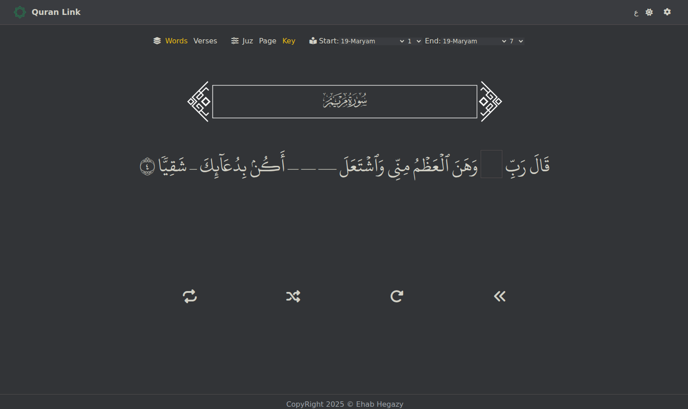
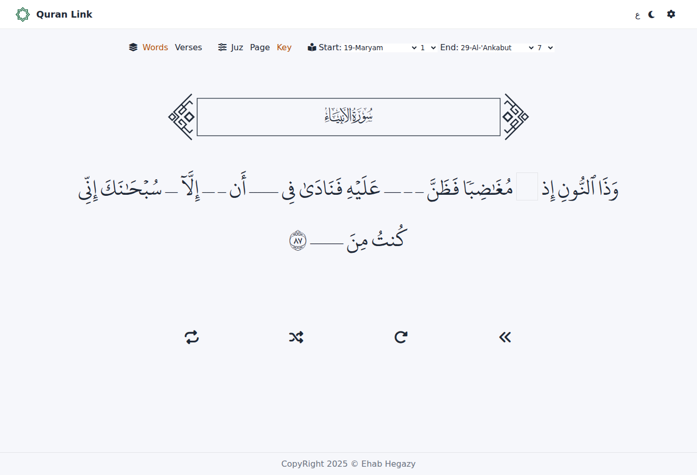
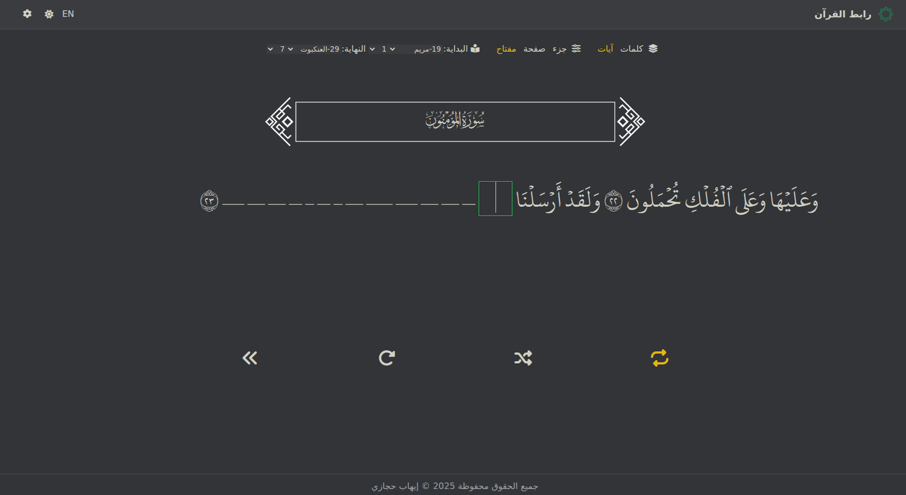

**Quran Link**

A full-stack application for Quran memorization practice with a Vue.js frontend and FastAPI backend. Features interactive word-by-word and verse-by-verse testing with customizable ranges (by page, juz, or specific verses).

## Screenshots

### Main Interface

*The main testing interface with Arabic text and word-by-word input*

### Dark & Light Themes
<div style="display: flex; gap: 10px;">
  
  
</div>

*Support for both dark and light themes with system preference detection*

### Bilingual Support

*Full Arabic interface with RTL support*

---

## Quick Overview
**Backend:** FastAPI server providing JSON endpoints for Surahs and Ayahs from a local SQLite database.
**Frontend:** Vue 3 SPA with i18n support (Arabic/English), dark/light themes, and interactive testing modes.

### Project Structure
- **[server/](server/)** — FastAPI backend
  - [app.py](server/app.py) — Main server file
  - [populat_data.py](server/populat_data.py) — Database population script
  - [modules/engine/db_storage.py](server/modules/engine/db_storage.py) — Storage backend
- **[client/](client/)** — Vue.js frontend
  - [src/App.vue](client/src/App.vue) — Main application component
  - [src/components/](client/src/components/) — Reusable Vue components

---

## Backend Setup

### Requirements
- **Python:** 3.8+
- **Dependencies:** see [server/requirements.txt](server/requirements.txt)

### Installation

```bash
cd server
python3 -m venv venv
source venv/bin/activate
pip install -r requirements.txt
```

### Database & Data
- By default the app uses a file SQLite DB at `server/data/quran.db`.
- Set `QL_ENV=test` to use an in-memory DB (useful for tests).
- The project stores compressed JSON source files under [server/data](server/data).

To populate the database:

```bash
cd server
python populat_data.py
```

### Running the Server

Development mode:

```bash
cd server
source venv/bin/activate
uvicorn app:app --reload --host 0.0.0.0 --port 8000
```

Or use the provided shortcut:

```bash
cd server
./start.sh
```

### Environment Variables
- `API_URL` (optional): Injected into `public/index.html` as `window.__API_URL__` so the frontend can discover the API base URL.
- `QL_ENV`: Set to `test` to use an in-memory database.

### HTTP API Endpoints

**GET `/surahs`**
- Returns: Array of Surah objects (`id`, `name`, `en_name`, `ayahs_count`)
- Response model: `SurahRespond` ([server/data/schema.py](server/data/schema.py))

**GET `/verses?range_type=<type>&range_value=<value>`**
- **range_type:** `page`, `juz`, or `key`
- **range_value:** 
  - For `page` and `juz`: `start:end` (e.g., `1:3`)
  - For `key`: `surah:ayah-surah:ayah` (e.g., `2:255-2:260`)
- Returns: Array of verse objects
- Response model: `VerseRespond` ([server/data/schema.py](server/data/schema.py))
- Validation: [server/utils/validate_range.py](server/utils/validate_range.py)

**GET `/pages?pages=<start:end>`**
- Returns: List of verse objects representing page boundaries

**Static Files:** Served from [server/public](server/public) at `/`

### Storage Architecture
- **SQLAlchemy storage:** [server/modules/engine/db_storage.py](server/modules/engine/db_storage.py)
- **ORM models:** [server/modules/surahs.py](server/modules/surahs.py) and [server/modules/ayahs.py](server/modules/ayahs.py)

### Testing

```bash
cd server
source venv/bin/activate
pytest -q
```

Tests are located in [server/tests](server/tests).

---

## Frontend Setup

### Requirements
- **Node.js:** 14+ and npm
- **Framework:** Vue 3 with Vue CLI

### Installation

```bash
cd client
npm install
```

### Development

Run the development server:

```bash
cd client
npm run serve
```

The app will be available at `http://localhost:8080` (or the next available port).

### Build for Production

```bash
cd client
npm run build
```

This builds the SPA and outputs to `../server/public` (configured in [client/vue.config.js](client/vue.config.js)), allowing the backend to serve the frontend.

### Features

**Testing Modes:**
- **Words mode:** Fill in missing words from individual verses
- **Verses mode:** Complete entire verses in sequence

**Range Selection:**
- **Page:** Select Quran pages (1-604)
- **Juz:** Select Juz sections (1-30)
- **Key:** Select specific verse ranges (surah:verse format)

**UI Features:**
- **Bilingual:** Arabic and English interface (i18n)
- **Theme:** Dark/light mode with localStorage persistence
- **Interactive controls:** Shuffle, repeat, restart, next verse
- **Toast notifications:** Error and success messages
- **Responsive design:** Desktop and mobile optimized

### Project Architecture

**Components:**
- [ButtonOptions.vue](client/src/components/ButtonOptions.vue) — Button group selector
- [RangeSelector.vue](client/src/components/RangeSelector.vue) — Numeric range input (start:end)
- [VerseSelector.vue](client/src/components/VerseSelector.vue) — Surah:Ayah range picker
- [SurahBorder.vue](client/src/components/SurahBorder.vue) — Decorative Surah header
- [inputBox.vue](client/src/components/inputBox.vue) — Word input component
- [testVerse.vue](client/src/components/testVerse.vue) — Verse testing mode
- [testWord.vue](client/src/components/testWord.vue) — Word testing mode

**State Management:**
- [store.js](client/src/store.js) — Reactive store for shared utilities

**Internationalization:**
- [i18n/index.js](client/src/i18n/index.js) — i18n configuration
- [i18n/locales/](client/src/i18n/locales/) — Translation files (en.json, ar.json)

### API Configuration

The frontend detects the backend URL in this order:
1. `window.__API_URL__` (injected by server at runtime)
2. `VUE_APP_API_URL` environment variable
3. Fallback: `http://localhost:8000`

To set a custom API URL during development, create `.env.local`:

```bash
VUE_APP_API_URL=http://your-api-url:8000
```

---

## Full Stack Development

### Option 1: Run Both Separately

Terminal 1 (Backend):
```bash
cd server
source venv/bin/activate
uvicorn app:app --reload --host 0.0.0.0 --port 8000
```

Terminal 2 (Frontend):
```bash
cd client
npm run serve
```

### Option 2: Build & Serve from Backend

```bash
# Build frontend
cd client
npm run build

# Run backend (serves built frontend)
cd ../server
source venv/bin/activate
uvicorn app:app --host 0.0.0.0 --port 8000
```

Then visit `http://localhost:8000`

---

## Notes & Troubleshooting

- **Database population:** Ensure `server/data/hafsChapters_v3-0.json.gz` and `server/data/hafsVerses_v3.0.json.gz` exist before running `populat_data.py`.
- **API_URL injection:** The server only injects `API_URL` for root path requests. Configure properly when using proxies or non-standard paths.
- **CORS:** The backend allows all origins by default (development). Configure appropriately for production.
- **Testing:** Backend tests expect `QL_ENV=test` for in-memory database.

## What's Next

Explore the code starting with:
- Backend: [server/app.py](server/app.py) and [server/modules/engine/db_storage.py](server/modules/engine/db_storage.py)
- Frontend: [client/src/App.vue](client/src/App.vue) and [client/src/main.js](client/src/main.js)
